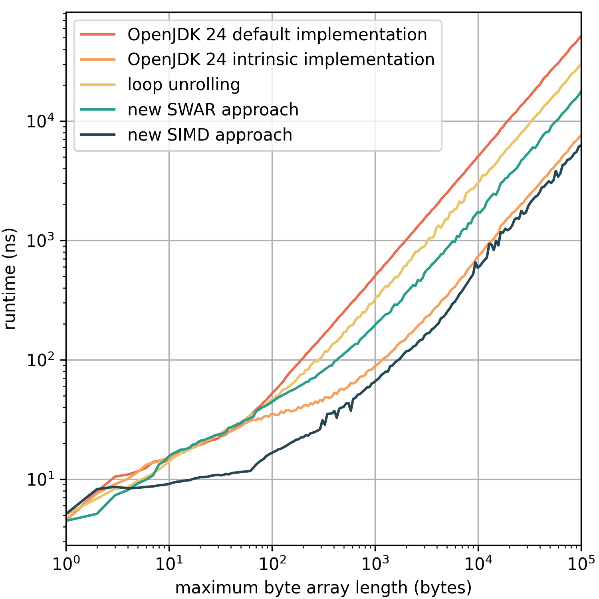

# Faster alternative implementations of Arrays.hashCode(byte[])

This repository contains implementations of `Arrays.hashCode(byte[])`, which beat the performance of the implementations in OpenJDK 24.0.1. 

## Benchmark Results

The figure below shows the benchmark results obtained on an AWS [c5.metal](https://aws.amazon.com/ec2/instance-types/c5/)
instance with disabled [Turbo Boost](https://de.wikipedia.org/wiki/Intel_Turbo_Boost) ([P-state](https://docs.aws.amazon.com/AWSEC2/latest/UserGuide/processor_state_control.html) set to 1).  


## Running Benchmarks

To perform the benchmarks execute
```
sudo sh -c "echo 1 > /sys/devices/system/cpu/intel_pstate/no_turbo"; ./gradlew jmh; sudo sh -c "echo 0 > /sys/devices/system/cpu/intel_pstate/no_turbo"
```
Turbo Boost is turned off during the benchmark's execution to achieve more reproducible results on Intel CPUs.
The benchmark results will be copied to the `benchmark-results` folder.

## Generating Charts

To generate charts from the results stored in the `benchmark-results` folder, execute 
```
python .\python\evaluation.py
```
in the root directory. The generated figures are put into the `benchmark-results` folder.